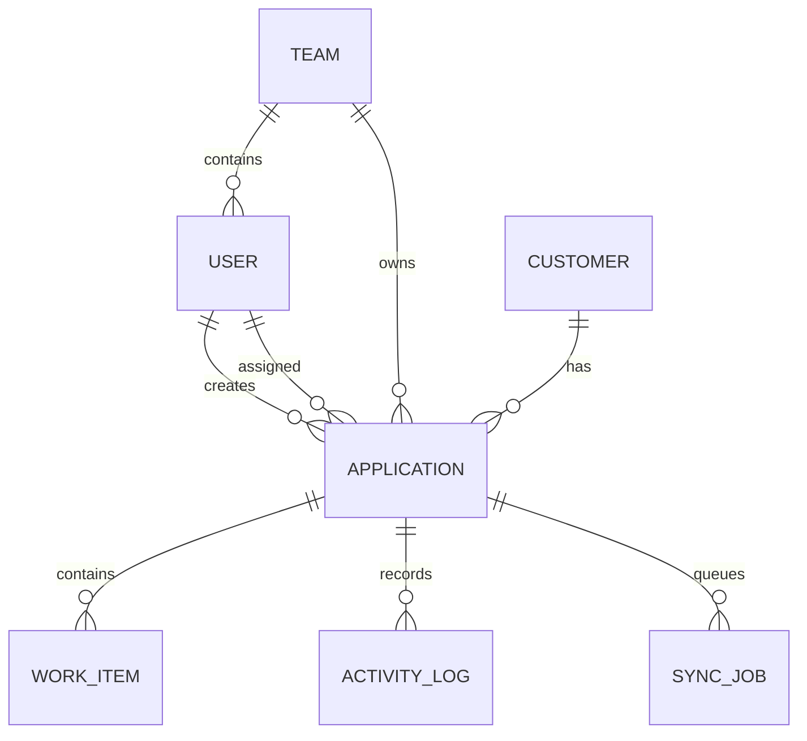

# Flowdesk

Customer Application & Workflow Management System for the Full Stack Developer assessment. The repository is a small npm-workspaces monorepo using Next.js App Router, Express, Prisma, PostgreSQL, and a shared TypeScript package.

## Setup Instructions

### Docker

1. Copy `apps/api/.env.example` and `apps/web/.env.example` to `.env` files if local overrides are needed.
2. Run `docker compose up --build`.
3. Open `http://localhost:3000`. API health is at `http://localhost:4000/api/health`; Swagger is at `http://localhost:4000/api/docs`.

The API container pushes the Prisma schema and seeds demo data on startup. For a local install, run `npm install`, copy the env examples, start PostgreSQL, then run `npm run db:push`, `npm run db:seed`, and `npm run dev`.

Demo password for all users is `demo1234`:

- Admin: `admin@workflow.local`
- Manager: `manager1@workflow.local` or `manager2@workflow.local`
- Executive: `exec1@workflow.local` through `exec4@workflow.local`

## Architecture

```text
Next.js web (React Query + Tailwind)
          | HTTP, credentials: include
Express REST API (JWT cookie, RBAC, Zod, Swagger)
          | Prisma
PostgreSQL (application data + append-only activity + sync outbox)
          ^
  in-process sync poller -> mock CRM
```

The API owns business rules and authorization. The web client is a focused operations view and never substitutes UI visibility for server checks. `packages/shared` contains workflow states and validation contracts used by both applications.

## Data Model



UUIDs, timestamps, and versions are used throughout mutable entities. Applications have indexes on status, assignee, customer, and team. Activity logs are append-only. `SyncJob.idempotencyKey` is unique.

## Application Design

The frontend calls resource-based REST endpoints and receives `{ data, error }`. React Query owns server state and invalidates the dashboard/list after mutations. The backend uses a shared `scope(user)` query filter for admin-wide, manager-team, and executive-assignee visibility.

Workflow transitions are declared in `packages/shared/src/index.ts`. The API rejects transitions outside the map, rejects executive reopen attempts, increments `Application.version`, and returns `409` when the version read by the client is stale. Completion and its activity plus pending sync job are written in one transaction; sync failure never rolls back completion.

## Authentication and Authorization

Login issues a short-lived JWT in an httpOnly, SameSite=Lax cookie. `requireAuth` verifies it on protected routes and `requireRole` handles coarse role gates. Admins see all records. Managers are scoped to their team and can manage its applications and work items. Executives are scoped to applications assigned to their own user and cannot reopen or reassign.

Every mutation performs the scope query server-side. The UI hides actions that do not apply to a role, but this is only a usability layer. Missing resources are generally returned as `404` after scope filtering so the API does not reveal another team’s data.

## External Integration

A transition to `COMPLETED` creates a pending outbox row with a deterministic application/timestamp key. A lightweight five-second in-process poller simulates the CRM call with latency and transient failures. A memory map makes repeated calls with the same key return the same external result. Failures move through retrying with a five-attempt limit and then become manually retryable `FAILED` jobs.

An assessment-sized poller avoids the operational overhead of Redis or a managed queue, at the cost of durability and horizontal coordination. In production, the worker would become BullMQ + Redis or SQS/EventBridge: the transaction still writes the outbox, a durable publisher/consumer claims jobs, retry policy moves exhausted messages to a dead-letter queue, and deployment would use multiple workers safely through queue visibility/locking. A leader election or queue-based claiming strategy is required before running pollers on multiple API instances.

## Assumptions and Trade-offs

PostgreSQL fits relational ownership, workflow history, indexes, and transactional outbox writes better than MongoDB; the trade-off is schema migration overhead. JWT cookies keep the API independently deployable without introducing a hosted auth dependency; the trade-off is that refresh-token rotation, revocation, and account recovery still need production work. The outbox poller is intentionally simpler than BullMQ/Redis because this assessment needs one command and a small operational footprint.

Pagination, full admin CRUD for users/teams, and rich assignment controls are intentionally narrower than a production operations suite. The first screen prioritizes the highest-risk assessment behavior: scoped reads, valid transitions, optimistic concurrency, completion side effects, and sync visibility.

## Enhancement QA Audit

Confirmed: all seeded roles authenticate; JWT sessions persist across refresh; application list and dashboard queries use stable keys; role scoping is applied server-side; search filters applications and customers; workflow options come from the explicit transition map; invalid transitions and executive reopen attempts are rejected; optimistic version conflicts return `409`; unauthorized application details return `404`; completion creates a transactional sync job; retry failures are persisted with exponential backoff; and sync failures do not change the completed application status.

Implemented in this pass: customer create/detail endpoints, scoped application assignment/reassignment, work-item assignment validation, visible dashboard/list error states with Retry actions, a 15-second request timeout, skeleton loading states, retry scheduling via `nextAttemptAt`, and a visual pass for depth, badge hierarchy, priority scanning, row hover, and detail-panel motion.

Partial: the UI currently focuses on the dashboard and application detail workflow; customer screens, application create/edit forms, assignment selectors, pagination controls, and full work-item controls are API-ready but not surfaced in the compact first screen. Automated coverage remains focused on the transition map and idempotency key; browser-based role and two-tab concurrency verification should be added with Playwright in a production review.

The loading bug was caused by requests having no timeout while dashboard failures were rendered as zero through fallback expressions such as `stats?.total || 0`. Requests now abort after 15 seconds, dashboard failures are visible, and the application queue always offers a Retry action.

## Incomplete Features

The seeded system includes application and work-item workflows, dashboard metrics, customer search, sync status, and Swagger entry point. A production expansion would add full customer/application creation forms, assignment selectors, cursor pagination, structured audit metadata, and a separate worker deployment. These were kept out of the compact assessment implementation rather than represented as fake UI.

## Production Considerations

Add structured logs and tracing around auth, transition, and sync job IDs; move secrets to a managed secret store; add rate limiting, CSRF strategy, email verification, refresh-token rotation, connection pooling, migrations in CI, and database backups. Run sync workers separately with durable claiming, dead-letter handling, metrics, and alerts. Horizontal API instances must not each independently process the same outbox row.

## Testing

`apps/api/src/workflow.test.ts` covers the transition table and deterministic idempotency behavior. The highest-value follow-up tests are Supertest cases against a test database for executive scope and completion outbox creation, plus React Testing Library coverage for valid transition options and the 409 refresh state. Full coverage was deliberately not pursued within the assessment time budget.

## AI and Tools Used

AI assistance was used to scaffold the monorepo, draft Prisma models, API handlers, seed data, UI composition, Docker files, and documentation. The implementation was reviewed and corrected through local TypeScript builds, Prisma client generation, and the explicit workflow/concurrency checks described above. No external proprietary code or generated credentials were copied into the repository.
